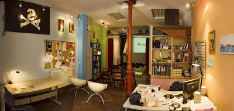

<!-- vscode-markdown-toc -->
* 1. [Intro](#Intro)
* 2. [New features](#Newfeatures)
	* 2.1. [Iframe feature](#Iframefeature)
		* 2.1.1. [Open links in an iframe in the current page](#Openlinksinaniframeinthecurrentpage)
		* 2.1.2. [iframe warnings](#iframewarnings)
		* 2.1.3. [load local pages inside the iframe](#loadlocalpagesinsidetheiframe)
	* 2.2. [Sound Audio Features](#SoundAudioFeatures)
		* 2.2.1. [mute button](#mutebutton)
		* 2.2.2. [mute sound if player goes AFK](#mutesoundifplayergoesAFK)
	* 2.3. [Sections and surveys feature](#Sectionsandsurveysfeature)
		* 2.3.1. [show section](#showsection)
		* 2.3.2. [add survey](#addsurvey)
	* 2.4. [Traffic log features](#Trafficlogfeatures)
		* 2.4.1. [Traffic log](#Trafficlog)
		* 2.4.2. [Traffic resume by email](#Trafficresumebyemail)
	* 2.5. [Graphic features](#Graphicfeatures)
		* 2.5.1. [different resolution background images](#differentresolutionbackgroundimages)
		* 2.5.2. [force scale and offset](#forcescaleandoffset)
		* 2.5.3. [perspective mode](#perspectivemode)
		* 2.5.4. [animated background](#animatedbackground)
	* 2.6. [Other improvements](#Otherimprovements)
		* 2.6.1. [Join and Leave functions for any room](#JoinandLeavefunctionsforanyroom)
		* 2.6.2. [Define actions on NPC clicks](#DefineactionsonNPCclicks)
		* 2.6.3. [Define actions in text commands](#Defineactionsintextcommands)
		* 2.6.4. [definepre and post action](#definepreandpostaction)
		* 2.6.5. [Debug more accesible](#Debugmoreaccesible)
* 3. [credits](#credits)
	* 3.1. [Image licenses](#Imagelicenses)
	* 3.2. [Music licenses](#Musiclicenses)

<!-- vscode-markdown-toc-config
	numbering=true
	autoSave=true
	/vscode-markdown-toc-config -->
<!-- /vscode-markdown-toc -->
# BARRICUDA LIKELIKE Online

##  1. <a name='Intro'></a>Intro

The tiniest MMORPG. Choose an avatar and hang out with your friends in a virtual version of [La Barricuda](http://labarricuda.blogspot.com/2006/10/instalaciones.html).




<a href="http://likelike-barricuda.glitch.me" target="_blank">>>>Try it here<<<</a>

Aventuras visuales is an avant garde cinema school and collective in Madrid (Spain). This is a virtual tribute to 'La Barricuda', their beloved local where the workshops took place, which closed years ago, in 2009.

This project is an extension of original [likelike](https://github.com/molleindustria/likelike-online) by [molleindustria](molleindustria.org) and is commisioned by [arsGames](https://arsgames.net/)

Look [here](https://github.com/molleindustria/likelike-online#readme) for basic usage instructions.


##  2. <a name='Newfeatures'></a>New features

###  2.1. <a name='Iframefeature'></a>Iframe feature

####  2.1.1. <a name='Openlinksinaniframeinthecurrentpage'></a>Open links in an iframe in the current page

Now you can define a link to open in an iframe inside the current page instead of open it in a new tab. For this, add this attribute in the command definition (valid for areas and things):

    iframe: true

In example:

    h0066ff: { cmd: "text", iframe: true, label: "myLabel", point: [62, 77], txt: 'Intro text', lines: 1, url: "https://www.whatever.com" }

####  2.1.2. <a name='iframewarnings'></a>iframe warnings

Be careful to check if the url selected allow iframes. 

####  2.1.3. <a name='loadlocalpagesinsidetheiframe'></a>load local pages inside the iframe

You can put html pages in the public folder and load them inside the iframe.

###  2.2. <a name='SoundAudioFeatures'></a>Sound Audio Features

Some basic sound features were added.

####  2.2.1. <a name='mutebutton'></a>mute button

A button to switch on/off the audio.

####  2.2.2. <a name='mutesoundifplayergoesAFK'></a>mute sound if player goes AFK

A new function to switch on/off audio if player goes Away From Keyboard. This happens when players change their browser tab and also when a player interacts with some iframed content.

###  2.3. <a name='Sectionsandsurveysfeature'></a>Sections and surveys feature

####  2.3.1. <a name='showsection'></a>show section

Parrafo

####  2.3.2. <a name='addsurvey'></a>add survey

Look at clientMod.js to see how to define a survey. It allows normal inputs, checkbox selectors (with and without images) and radio selectors. Surveys html are auto generated inside a section element added in the index.html.

You can define a function to receive the form answers after been executed, declare it in clientMod and reference it in the postAction attribute when defining the survey.

If log feature is activated, the answers will be recorded in the log.

###  2.4. <a name='Trafficlogfeatures'></a>Traffic log features

####  2.4.1. <a name='Trafficlog'></a>Traffic log

Add this to .env file:

```
TRAFFICLOG=true
WEEKLOG=false
```

A log file will be created in /logs.  It will register the following actions in a csv file.

* server start

    ```
    timestamp (ISO format), 'serverStart'
    ```

* user login:

    ```
    timeStamp (ISO format), userID, 'join', user name, starting room name, IP address
    ```

* user change room:

    ```
    timeStamp (ISO format), userID, 'room', new room name
    ```

* user focus:

    ```
    timeStamp (ISO format), userID, 'focus'
    ```

* user blur:

    ```
    timeStamp (ISO format), userID, 'blur'
    ```

* user disconnect:

    ```
    timeStamp (ISO format), userID, 'disconnect'
    ```

If you set WEEKLOG to true, a report will be collected each week.

> Warning: There is no fallback for the cron tasks, so, if your server has a lot of resets you better set WEEKLOG to false.

####  2.4.2. <a name='Trafficresumebyemail'></a>Traffic resume by email

You should activate Traffic log feature for this to work!!!

Add this to .env file to activate this feature:

    ```
    SENDLOG=true
    MAILHOST=SMTP ongoing server
    MAILUSER=mail login
    MAILPASS=password
    MAILTO=to@domain.com
    MAILBCC=bcc@domain.com
    TIMEZONE="Europe/Madrid"
    ```

TIMEZONE is optional, "GMT" is the default. Look [here](https://raw.githubusercontent.com/node-cron/tz-offset/master/generated/offsets.json) for available timezones. This is important to sync cron tasks with your server locale time.

Three cron tasks will be created:

* A daily task at 00:00AM to rename log file to match current date

* An every monday task at 04:00AM to compile previous week into a single file and send it by email.

      You can run this event at any time by using the '/collectWeek' admin command.

* A monthly task to compile all existing weekly logs into a single file, send it by email and copy it to public directory
 
      You can run this event at any time by using the '/collectGlobal' admin command

###  2.5. <a name='Graphicfeatures'></a>Graphic features

####  2.5.1. <a name='differentresolutionbackgroundimages'></a>different resolution background images

Adding this to the room declaration in the data file, you can bypass the 128x100 rule 

    bgScale: 1,
    bgResolution: [256, 200],


####  2.5.2. <a name='forcescaleandoffset'></a>force scale and offset

Force scale and offset to modify the appearance of things in the room.

I found a bug in the depthOffset calculation and fixed it to make it scale dependant. Now depth drawing will work with sprites in different scales.

In 'hall' room, look how i set the 'mesa' thing with a fixed offset of 10. Also the depth with the column will work at different avatarScales.

Look at 'sillas' things in the 'classroom' room. Each one uses a different scale and the scene profit from the bug fixed. You can change avatarScale and the depth calculation still works fine.

####  2.5.3. <a name='perspectivemode'></a>perspective mode

You can define a special function to calculate player scales for each room. This does not affect things, as they are expected to be static. Use scale and offset to align things in perspective. The debug mode draw is very helpfull for this, so i added a yellow line to show the depthOffset (it should be the 'feet' of the sprite at any scale)

Walk into 'cave' room to see it working.

####  2.5.4. <a name='animatedbackground'></a>animated background

Background become a sprite and can be animated. Define animated background adding this property "animations" in the data.js

    hall: {
        bg: "/barricuda/entrada-spritesheet.png",
        frames: 4,
        animations: { 
            bg0000: [0, 4], 
            bg0001: [4, 4], 
            bg0010: [8, 4], 
            ...
        },
        frameDelay: 60,
    ...

In this format:

        animations: {
            animName: [startframe, loopDuration (in frames) ]
        }

In our data example you can use the switches in  the hall floor to change animation.

Also, if you enter with admin (use 'admin|pass' as name) you can change bg animation by calling this command:

    /on 1001

or any combination of 4 binary digits, related to:   projector, hall lights, classroom lights, cave lights


change animation in bg:

    module.exports.setBgAnimagion = function (animationName) {
        // emit to all clients
        io.sockets.emit('changeBgAnim', animationName);
    }

This feature is a Work In Progress.

###  2.6. <a name='Otherimprovements'></a>Other improvements

####  2.6.1. <a name='JoinandLeavefunctionsforanyroom'></a>Join and Leave functions for any room

You can declare anyRoomJoin and anyRoomLeave functions in your serverMod file and they will be executed when entering and leaving any room, so you don't need to copypaste lots of code anymore.

####  2.6.2. <a name='DefineactionsonNPCclicks'></a>Define actions on NPC clicks

You can define actions to be triggered when clicking NPCs. In this example, clicking the 'divulgadorNpc will execute onDivulgador function, if it exist in your serverMod file.

    var divulgadorNpc = new NPC({
        id: "divulgador",
        nickName: "divulgador",
        room: "r02Entrada",
        x: 64,
        y: 81,
        avatar: 1,
        colors: [2, 2, 1, 5],
        labelColor: "#1e839d",
        actionId: "Divulgador"
    });

####  2.6.3. <a name='Defineactionsintextcommands'></a>Define actions in text commands

You can define an action inside a text command, to be executed at the time of running the command, or add the postAction attribute to force the execution after closing the text.

    hff00ff: { cmd: "text", txt: "some text", lines: 1, postAction: true, actionId: "MyAction",  label: "click me", point: [65, 95], obstacle: false },

This example runs onMyAction function after the text is closed. onMyAction function must be declared in your serverMod file.

####  2.6.4. <a name='definepreandpostaction'></a>definepre and post action

When defining actions associated to a text command, now you can select whether the action has to be executed before or after the text command is executed. For this you can set the attribute 'postAction' to true in the cmd definition

    hff00ff: { cmd: "text", txt: "some text", lines: 1, postAction: true, actionId: "MyAction",  label: "click me", point: [65, 95], obstacle: false },

####  2.6.5. <a name='Debugmoreaccesible'></a>Debug more accesible

In client.js you will find these selectors. Just set them to true.

    var QUICK_LOGIN = false;
    var DEBUG_CLICKS = false;
    var DEBUG_SPRITES = false;
    var DEBUG_CONSOLE = false;

DEBUG_CONSOLE will mute the console output (it's better for performance)

You can also mute server console by adding a .env variable

    VERBOSE=false

You can use DEBUGMAILTO variable in .env to define a mail for debug or admin alerts. 

    DEBUGMAILTO=mail@server.com

Put this line in the code to send an admin alert by mail.

    mailer.sendDebugMail('your debug mail subject here', 'Your mail content here');

##  3. <a name='credits'></a>credits

Code licensed under a GNU Lesser General Public License v2.1.


###  3.1. <a name='Imagelicenses'></a>Image licenses 

hall, classroom and cave images by Carlos Padial  CC-by-nc

desert images from https://cocomaterial.com/

###  3.2. <a name='Musiclicenses'></a>Music licenses 

Iced Earth, by Dragan Espenschied CC-by-nc

Procrastination Polka by Dragan Espenschied CC-by-nc

Zombie & Mummy Theme by Dragan Espenschied CC-by-nc

Dragan Espenschied https://freemusicarchive.org/music/Dragan_Espenschied#contact-artist
